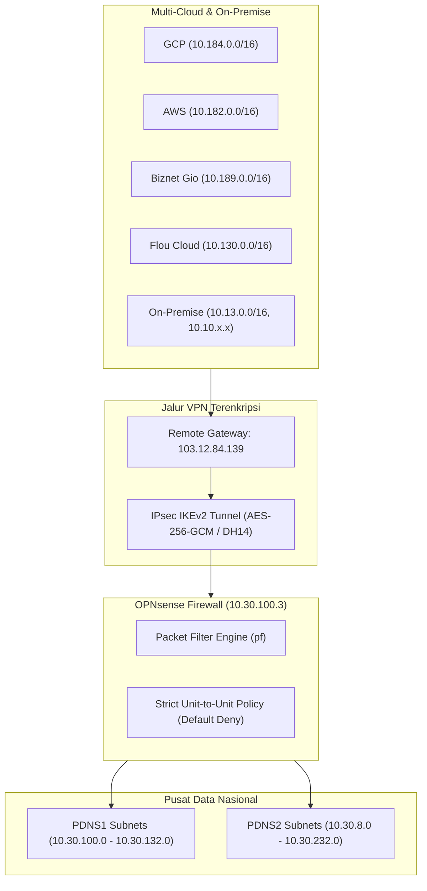

# Dokumentasi Teknis Konfigurasi Firewall OPNsense

**Dokumen Referensi Resmi & Standar Operasional Prosedur (SOP)**  
**Perangkat:** Firewall OPNsense  
**Hostname:** `OPNsense.internal`  
**IP Utama (WAN):** `10.30.100.3/23` (PDNS1)  
**Versi Sistem:** OPNsense 26.7.3_8-amd64 / FreeBSD 15.1-RELEASE  
**Tanggal Penyusunan:** September 2026  

---

## 1. Arsitektur Jaringan & Diagram Topologi

Firewall OPNsense bertindak sebagai gerbang keamanan sentral di **Pusat Data Nasional 1 (PDNS1)** yang menghubungkan berbagai lingkungan infrastruktur (**GCP**, **AWS**, **Biznet Gio**, **Flou Cloud**, **PDNS2**, dan **On-Premise**) melalui tunnel IPsec IKEv2 terenkripsi dengan kebijakan isolasi ketat (*Strict Unit-to-Unit Isolation*).

---

## 2. Rincian Antarmuka (Interfaces)

| Identifier | Device | Tipe | IP Address / CIDR | Gateway | Keterangan |
|---|---|:---:|---|---|---|
| **WAN** | `vmx1` | DHCP/Static | `10.30.100.3/23` | `10.30.100.1` | Antarmuka uplink PDNS1 |
| **LAN** | `vmx0` | Static | `192.168.1.1/24` | - | Antarmuka lokal manajemen |
| **IPsec (enc0)**| `enc0` | Virtual | Dynamic | - | Antarmuka enkapsulasi/dekapsulasi IPsec |
| **Tailscale**| `tailscale0` | Virtual VPN | `100.93.180.17/32` | - | Remote Access & Admin Management |
| **Loopback**| `lo0` | Virtual | `127.0.0.1/8` | - | Sistem internal loopback |

---

## 3. Direktori Network Aliases Multi-Cloud & Data Center

Total **95 Network Aliases** terdaftar untuk memetakan seluruh unit kerja di setiap lokasi:

### 3.1 Google Cloud Platform (GCP - `10.184.0.0/16`)
| Nama Alias | Network (CIDR) | Gateway | Unit / Deskripsi |
|---|---|---|---|
| `NET_GCP_ALL` | `10.184.0.0/16` | - | GCP Supernet / All Subnets |
| `NET_GCP_ADMIN` | `10.184.8.0/23` | `10.184.8.1` | GCP Administrative |
| `NET_GCP_SETJEN` | `10.184.10.0/23` | `10.184.10.1` | GCP Setjen |
| `NET_GCP_ITJEN` | `10.184.12.0/23` | `10.184.12.1` | GCP Itjen |
| `NET_GCP_DJSDA` | `10.184.14.0/23` | `10.184.14.1` | GCP DJSDA |
| `NET_GCP_DJBM` | `10.184.16.0/23` | `10.184.16.1` | GCP DJBM |
| `NET_GCP_DJCK` | `10.184.18.0/23` | `10.184.18.1` | GCP DJCK |
| `NET_GCP_DJPS` | `10.184.20.0/23` | `10.184.20.1` | GCP DJP / DJPS |
| `NET_GCP_DJBK` | `10.184.22.0/23` | `10.184.22.1` | GCP DJBK |
| `NET_GCP_DJPI` | `10.184.24.0/23` | `10.184.24.1` | GCP DJPI |
| `NET_GCP_BPIW` | `10.184.26.0/23` | `10.184.26.1` | GCP BPIW |
| `NET_GCP_BPSDM` | `10.184.28.0/23` | `10.184.28.1` | GCP BPSDM |
| `NET_GCP_BPJT` | `10.184.30.0/23` | `10.184.30.1` | GCP BPJT |
| `NET_GCP_PUSDATIN` | `10.184.184.0/24`| `10.184.184.1` | GCP Setjen, Pusdatin |

---

### 3.2 Amazon Web Services (AWS - `10.182.0.0/16`)
| Nama Alias | Network (CIDR) | Gateway | Unit / Deskripsi |
|---|---|---|---|
| `NET_AWS_ALL` | `10.182.0.0/16` | - | AWS Supernet / All Subnets |
| `NET_AWS_ADMIN` | `10.182.8.0/23` | `10.182.8.1` | AWS Administrative |
| `NET_AWS_SETJEN` | `10.182.10.0/23` | `10.182.10.1` | AWS Setjen |
| `NET_AWS_ITJEN` | `10.182.12.0/23` | `10.182.12.1` | AWS Itjen |
| `NET_AWS_DJSDA` | `10.182.14.0/23` | `10.182.14.1` | AWS DJSDA |
| `NET_AWS_DJBM` | `10.182.16.0/23` | `10.182.16.1` | AWS DJBM |
| `NET_AWS_DJCK` | `10.182.18.0/23` | `10.182.18.1` | AWS DJCK |
| `NET_AWS_DJPS` | `10.182.20.0/23` | `10.182.20.1` | AWS DJP / DJPS |
| `NET_AWS_DJBK` | `10.182.22.0/23` | `10.182.22.1` | AWS DJBK |
| `NET_AWS_DJPI` | `10.182.24.0/23` | `10.182.24.1` | AWS DJPI |
| `NET_AWS_BPIW` | `10.182.26.0/23` | `10.182.26.1` | AWS BPIW |
| `NET_AWS_BPSDM` | `10.182.28.0/23` | `10.182.28.1` | AWS BPSDM |
| `NET_AWS_BPJT` | `10.182.30.0/23` | `10.182.30.1` | AWS BPJT |

---

### 3.3 Biznet Gio (`10.189.0.0/16`)
| Nama Alias | Network (CIDR) | Gateway | Unit / Deskripsi |
|---|---|---|---|
| `NET_BIZNET_ALL` | `10.189.0.0/16` | - | Biznet Gio Supernet / All Subnets |
| `NET_BIZNET_ADMIN` | `10.189.8.0/23` | `10.189.8.1` | Biznet Gio Administrative |
| `NET_BIZNET_SETJEN` | `10.189.10.0/23` | `10.189.10.1` | Biznet Gio Setjen |
| `NET_BIZNET_ITJEN` | `10.189.12.0/23` | `10.189.12.1` | Biznet Gio Itjen |
| `NET_BIZNET_DJSDA` | `10.189.14.0/23` | `10.189.14.1` | Biznet Gio DJSDA |
| `NET_BIZNET_DJBM` | `10.189.16.0/23` | `10.189.16.1` | Biznet Gio DJBM |
| `NET_BIZNET_DJCK` | `10.189.18.0/23` | `10.189.18.1` | Biznet Gio DJCK |
| `NET_BIZNET_DJPS` | `10.189.20.0/23` | `10.189.20.1` | Biznet Gio DJP / DJPS |
| `NET_BIZNET_DJBK` | `10.189.22.0/23` | `10.189.22.1` | Biznet Gio DJBK |
| `NET_BIZNET_DJPI` | `10.189.24.0/23` | `10.189.24.1` | Biznet Gio DJPI |
| `NET_BIZNET_BPIW` | `10.189.26.0/23` | `10.189.26.1` | Biznet Gio BPIW |
| `NET_BIZNET_BPSDM` | `10.189.28.0/23` | `10.189.28.1` | Biznet Gio BPSDM |
| `NET_BIZNET_BPJT` | `10.189.30.0/23` | `10.189.30.1` | Biznet Gio BPJT |

---

### 3.4 Flou Cloud (`10.130.0.0/16`)
| Nama Alias | Network (CIDR) | Gateway | Unit / Deskripsi |
|---|---|---|---|
| `NET_FLOU_ALL` | `10.130.0.0/16` | - | Flou Cloud Supernet / All Subnets |
| `NET_FLOU_ADMIN` | `10.130.8.0/23` | `10.130.9.254` | Flou Cloud Administrative |
| `NET_FLOU_SETJEN` | `10.130.10.0/23` | `10.130.11.254` | Flou Cloud Setjen |
| `NET_FLOU_ITJEN` | `10.130.12.0/23` | `10.130.13.254` | Flou Cloud Itjen |
| `NET_FLOU_DJSDA` | `10.130.14.0/23` | `10.130.15.254` | Flou Cloud DJSDA |
| `NET_FLOU_DJBM` | `10.130.16.0/23` | `10.130.17.254` | Flou Cloud DJBM |
| `NET_FLOU_DJCK` | `10.130.18.0/23` | `10.130.19.254` | Flou Cloud DJCK |
| `NET_FLOU_DJP_KPKP` | `10.130.20.0/23` | `10.130.21.254` | Flou Cloud DJP / KPKP |
| `NET_FLOU_DJBK` | `10.130.22.0/23` | `10.130.23.254` | Flou Cloud DJBK |
| `NET_FLOU_DJPI` | `10.130.24.0/23` | `10.130.25.254` | Flou Cloud DJPI |
| `NET_FLOU_BPIW` | `10.130.26.0/23` | `10.130.27.254` | Flou Cloud BPIW |
| `NET_FLOU_BPSDM` | `10.130.28.0/23` | `10.130.29.254` | Flou Cloud BPSDM |
| `NET_FLOU_BPJT` | `10.130.30.0/23` | `10.130.31.254` | Flou Cloud BPJT |
| `NET_FLOU_EX_GCP` | `10.130.32.0/23` | `10.130.33.254` | Flou Cloud Ex-GCP |

---

### 3.5 Pusat Data Nasional 1 (PDNS1 - `10.30.0.0/16`)
| Nama Alias | Network (CIDR) | Gateway | Unit / Deskripsi |
|---|---|---|---|
| `NET_PDN_ALL` | `10.30.0.0/16` | - | PDN Supernet / All Subnets |
| `NET_PDNS1_ADMIN` | `10.30.100.0/23` | `10.30.100.1` | PDNS1 Administrative |
| `NET_PDNS1_NETSERVICES` | `10.30.108.0/23` | `10.30.108.1` | PDNS1 Network Services |
| `NET_PDNS1_SETJEN` | `10.30.110.0/23` | `10.30.110.1` | PDNS1 Setjen |
| `NET_PDNS1_ITJEN` | `10.30.112.0/23` | `10.30.112.1` | PDNS1 Itjen |
| `NET_PDNS1_DJSDA` | `10.30.114.0/23` | `10.30.114.1` | PDNS1 DJSDA |
| `NET_PDNS1_DJBM` | `10.30.116.0/23` | `10.30.116.1` | PDNS1 DJBM |
| `NET_PDNS1_DJCK` | `10.30.118.0/23` | `10.30.118.1` | PDNS1 DJCK |
| `NET_PDNS1_DJP_KPKP` | `10.30.120.0/23` | `10.30.120.1` | PDNS1 DJP / KPKP |
| `NET_PDNS1_DJBK` | `10.30.122.0/23` | `10.30.122.1` | PDNS1 DJBK |
| `NET_PDNS1_DJPI` | `10.30.124.0/23` | `10.30.124.1` | PDNS1 DJPI |
| `NET_PDNS1_BPIW` | `10.30.126.0/23` | `10.30.126.1` | PDNS1 BPIW |
| `NET_PDNS1_BPSDM` | `10.30.128.0/23` | `10.30.128.1` | PDNS1 BPSDM |
| `NET_PDNS1_BPJT` | `10.30.130.0/23` | `10.30.130.1` | PDNS1 BPJT |
| `NET_PDNS1_DJPS` | `10.30.132.0/23` | `10.30.132.1` | PDNS1 DJPS |

---

### 3.6 Pusat Data Nasional 2 (PDNS2)
#### A. Kelompok ex-Ransomware
| Nama Alias | Network (CIDR) | Gateway | Deskripsi |
|---|---|---|---|
| `NET_PDNS2_EXRANSOM_ADMIN` | `10.30.8.0/23` | - | PDNS2 Administrative (ex-Ransomware) |
| `NET_PDNS2_EXRANSOM_SETJEN` | `10.30.10.0/23` | `10.30.10.1` | PDNS2 Setjen (ex-Ransomware) |
| `NET_PDNS2_EXRANSOM_ITJEN` | `10.30.12.0/23` | `10.30.12.1` | PDNS2 Itjen (ex-Ransomware) |
| `NET_PDNS2_EXRANSOM_DJSDA` | `10.30.14.0/23` | `10.30.14.1` | PDNS2 DJSDA (ex-Ransomware) |
| `NET_PDNS2_EXRANSOM_DJBM` | `10.30.16.0/23` | `10.30.16.1` | PDNS2 DJBM (ex-Ransomware) |
| `NET_PDNS2_EXRANSOM_DJCK` | `10.30.18.0/23` | `10.30.18.1` | PDNS2 DJCK (ex-Ransomware) |
| `NET_PDNS2_EXRANSOM_DJP_KPKP` | `10.30.20.0/23`| `10.30.20.1` | PDNS2 DJP / KPKP (ex-Ransomware) |
| `NET_PDNS2_EXRANSOM_DJBK` | `10.30.22.0/23` | `10.30.22.1` | PDNS2 DJBK (ex-Ransomware) |
| `NET_PDNS2_EXRANSOM_DJPI` | `10.30.24.0/23` | `10.30.24.1` | PDNS2 DJPI (ex-Ransomware) |
| `NET_PDNS2_EXRANSOM_BPIW` | `10.30.26.0/23` | `10.30.24.1` | PDNS2 BPIW (ex-Ransomware) |
| `NET_PDNS2_EXRANSOM_BPSDM` | `10.30.28.0/23` | `10.30.28.1` | PDNS2 BPSDM (ex-Ransomware) |
| `NET_PDNS2_EXRANSOM_BPJT` | `10.30.30.0/23` | `10.30.30.1` | PDNS2 BPJT (ex-Ransomware) |

#### B. Kelompok ex-Flou Cloud
| Nama Alias | Network (CIDR) | Gateway | Deskripsi |
|---|---|---|---|
| `NET_PDNS2_EXFLOU_ALL` | `10.30.192.0/18`| - | PDNS2 Supernet (ex-Flou Cloud) |
| `NET_PDNS2_EXFLOU_NETSERVICES` | `10.30.208.0/24`| `10.30.208.1` | PDNS2 Network Services |
| `NET_PDNS2_EXFLOU_SETJEN` | `10.30.210.0/24`| `10.30.210.1` | PDNS2 Setjen (ex-Flou Cloud) |
| `NET_PDNS2_EXFLOU_ITJEN` | `10.30.212.0/24`| `10.30.212.1` | PDNS2 Itjen (ex-Flou Cloud) |
| `NET_PDNS2_EXFLOU_DJSDA` | `10.30.214.0/24`| `10.30.214.1` | PDNS2 DJSDA (ex-Flou Cloud) |
| `NET_PDNS2_EXFLOU_DJBM` | `10.30.216.0/24`| `10.30.216.1` | PDNS2 DJBM (ex-Flou Cloud) |
| `NET_PDNS2_EXFLOU_DJCK` | `10.30.218.0/24`| `10.30.218.1` | PDNS2 DJCK (ex-Flou Cloud) |
| `NET_PDNS2_EXFLOU_DJP_KPKP` | `10.30.220.0/24`| `10.30.220.1` | PDNS2 DJP / KPKP (ex-Flou Cloud) |
| `NET_PDNS2_EXFLOU_DJBK` | `10.30.222.0/24`| `10.30.222.1` | PDNS2 DJBK (ex-Flou Cloud) |
| `NET_PDNS2_EXFLOU_DJPI` | `10.30.224.0/24`| `10.30.224.1` | PDNS2 DJPI (ex-Flou Cloud) |
| `NET_PDNS2_EXFLOU_BPIW` | `10.30.226.0/24`| `10.30.226.1` | PDNS2 BPIW (ex-Flou Cloud) |
| `NET_PDNS2_EXFLOU_BPSDM` | `10.30.228.0/24`| `10.30.228.1` | PDNS2 BPSDM (ex-Flou Cloud) |
| `NET_PDNS2_EXFLOU_BPJT` | `10.30.230.0/24`| `10.30.230.1` | PDNS2 BPJT (ex-Flou Cloud) |
| `NET_PDNS2_EXFLOU_DJPS` | `10.30.232.0/24`| `10.30.232.1` | PDNS2 DJPS (ex-Flou Cloud) |

---

### 3.7 On-Premise Core & Remote Subnets
| Nama Alias | Network (CIDR) | Deskripsi |
|---|---|---|
| `NET_REMOTE_10_13` | `10.13.0.0/16` `10.10.240.0/24` `10.10.80.0/24` `10.10.254.16/29` | Network On-Premise Core & Servers Terhubung |
| `HOST_REMOTE_IPSEC_GW` | `103.12.84.139` (Host) | Remote IPsec VPN Public Gateway |

---

## 4. Katalog Group Aliases (Nested Groups per Unit)

Group Alias menggabungkan seluruh subnet unit kerja dari multi-cloud, PDNS2, serta jaringan On-Premise:

| Nama Group Alias | Daftar Subnet Anggota |
|---|---|
| **`GRP_SETJEN_REMOTE_ALL`** | `NET_GCP_SETJEN`, `NET_AWS_SETJEN`, `NET_BIZNET_SETJEN`, `NET_FLOU_SETJEN`, `NET_PDNS2_EXRANSOM_SETJEN`, `NET_PDNS2_EXFLOU_SETJEN`, `NET_REMOTE_10_13` |
| **`GRP_ITJEN_REMOTE_ALL`** | `NET_GCP_ITJEN`, `NET_AWS_ITJEN`, `NET_BIZNET_ITJEN`, `NET_FLOU_ITJEN`, `NET_PDNS2_EXRANSOM_ITJEN`, `NET_PDNS2_EXFLOU_ITJEN`, `NET_REMOTE_10_13` |
| **`GRP_DJSDA_REMOTE_ALL`** | `NET_GCP_DJSDA`, `NET_AWS_DJSDA`, `NET_BIZNET_DJSDA`, `NET_FLOU_DJSDA`, `NET_PDNS2_EXRANSOM_DJSDA`, `NET_PDNS2_EXFLOU_DJSDA`, `NET_REMOTE_10_13` |
| **`GRP_DJBM_REMOTE_ALL`** | `NET_GCP_DJBM`, `NET_AWS_DJBM`, `NET_BIZNET_DJBM`, `NET_FLOU_DJBM`, `NET_PDNS2_EXRANSOM_DJBM`, `NET_PDNS2_EXFLOU_DJBM`, `NET_REMOTE_10_13` |
| **`GRP_DJCK_REMOTE_ALL`** | `NET_GCP_DJCK`, `NET_AWS_DJCK`, `NET_BIZNET_DJCK`, `NET_FLOU_DJCK`, `NET_PDNS2_EXRANSOM_DJCK`, `NET_PDNS2_EXFLOU_DJCK`, `NET_REMOTE_10_13` |
| **`GRP_DJPS_REMOTE_ALL`** | `NET_GCP_DJPS`, `NET_AWS_DJPS`, `NET_BIZNET_DJPS`, `NET_FLOU_DJP_KPKP`, `NET_PDNS2_EXRANSOM_DJP_KPKP`, `NET_PDNS2_EXFLOU_DJP_KPKP`, `NET_PDNS2_EXFLOU_DJPS`, `NET_REMOTE_10_13` |
| **`GRP_DJBK_REMOTE_ALL`** | `NET_GCP_DJBK`, `NET_AWS_DJBK`, `NET_BIZNET_DJBK`, `NET_FLOU_DJBK`, `NET_PDNS2_EXRANSOM_DJBK`, `NET_PDNS2_EXFLOU_DJBK`, `NET_REMOTE_10_13` |
| **`GRP_DJPI_REMOTE_ALL`** | `NET_GCP_DJPI`, `NET_AWS_DJPI`, `NET_BIZNET_DJPI`, `NET_FLOU_DJPI`, `NET_PDNS2_EXRANSOM_DJPI`, `NET_PDNS2_EXFLOU_DJPI`, `NET_REMOTE_10_13` |
| **`GRP_BPIW_REMOTE_ALL`** | `NET_GCP_BPIW`, `NET_AWS_BPIW`, `NET_BIZNET_BPIW`, `NET_FLOU_BPIW`, `NET_PDNS2_EXRANSOM_BPIW`, `NET_PDNS2_EXFLOU_BPIW`, `NET_REMOTE_10_13` |
| **`GRP_BPSDM_REMOTE_ALL`** | `NET_GCP_BPSDM`, `NET_AWS_BPSDM`, `NET_BIZNET_BPSDM`, `NET_FLOU_BPSDM`, `NET_PDNS2_EXRANSOM_BPSDM`, `NET_PDNS2_EXFLOU_BPSDM`, `NET_REMOTE_10_13` |
| **`GRP_BPJT_REMOTE_ALL`** | `NET_GCP_BPJT`, `NET_AWS_BPJT`, `NET_BIZNET_BPJT`, `NET_FLOU_BPJT`, `NET_PDNS2_EXRANSOM_BPJT`, `NET_PDNS2_EXFLOU_BPJT`, `NET_REMOTE_10_13` |
| **`GRP_ADMIN_REMOTE_ALL`** | `NET_GCP_ADMIN`, `NET_AWS_ADMIN`, `NET_BIZNET_ADMIN`, `NET_FLOU_ADMIN`, `NET_PDNS2_EXRANSOM_ADMIN`, `NET_PDNS2_EXFLOU_NETSERVICES`, `NET_REMOTE_10_13` |
| **`GRP_PUSDATIN_REMOTE_ALL`**| `NET_GCP_PUSDATIN`, `NET_REMOTE_10_13` |

---

## 5. Matriks Kebijakan Firewall Filter (Strict Isolation)

### 5.1 Filosofi Keamanan
- **Default Deny:** Seluruh lalu lintas antar-jaringan diblokir secara bawaan (*implicit deny*).
- **Unit Isolation:** Unit X hanya diizinkan berkomunikasi dengan Unit X di PDNS1 (dan sebaliknya). Lalu lintas lintas unit (misal Setjen &rarr; Itjen) otomatis dibuang.
- **Audit Logging (`log: 1`):** Seluruh rule kustom mencatat log paket untuk kemudahan forensik dan monitoring SIEM.

### 5.2 Aturan Filter Antar-Unit (WAN & enc0 IPsec)

| No | Unit Kerja | Source / Destination (Bidirectional / Both) | Target Subnet PDNS1 | Action | Log |
|:---:|---|---|---|:---:|:---:|
| 1 | **Setjen** | `GRP_SETJEN_REMOTE_ALL` | `NET_PDNS1_SETJEN` | **Pass** | On |
| 2 | **Itjen** | `GRP_ITJEN_REMOTE_ALL` | `NET_PDNS1_ITJEN` | **Pass** | On |
| 3 | **DJSDA** | `GRP_DJSDA_REMOTE_ALL` | `NET_PDNS1_DJSDA` | **Pass** | On |
| 4 | **DJBM** | `GRP_DJBM_REMOTE_ALL` | `NET_PDNS1_DJBM` | **Pass** | On |
| 5 | **DJCK** | `GRP_DJCK_REMOTE_ALL` | `NET_PDNS1_DJCK` | **Pass** | On |
| 6 | **DJPS** | `GRP_DJPS_REMOTE_ALL` | `NET_PDNS1_DJP_KPKP`, `NET_PDNS1_DJPS` | **Pass** | On |
| 7 | **DJBK** | `GRP_DJBK_REMOTE_ALL` | `NET_PDNS1_DJBK` | **Pass** | On |
| 8 | **DJPI** | `GRP_DJPI_REMOTE_ALL` | `NET_PDNS1_DJPI` | **Pass** | On |
| 9 | **BPIW** | `GRP_BPIW_REMOTE_ALL` | `NET_PDNS1_BPIW` | **Pass** | On |
| 10 | **BPSDM** | `GRP_BPSDM_REMOTE_ALL` | `NET_PDNS1_BPSDM` | **Pass** | On |
| 11 | **BPJT** | `GRP_BPJT_REMOTE_ALL` | `NET_PDNS1_BPJT` | **Pass** | On |
| 12 | **Admin & Services**| `GRP_ADMIN_REMOTE_ALL` | `NET_PDNS1_ADMIN`, `NET_PDNS1_NETSERVICES` | **Pass** | On |
| 13 | **Pusdatin** | `GRP_PUSDATIN_REMOTE_ALL` | `NET_PDNS1_SETJEN`, `NET_PDNS1_ADMIN` | **Pass** | On |

---

## 6. Konfigurasi & Hardening IPsec VPN

### 6.1 Parameter Negosiasi (IKEv2 / Phase 1 & Phase 2)
- **Koneksi:** `ipsec-to-onprem`
- **Versi Protokol:** `IKEv2`
- **Phase 1 Proposal:** `aes256gcm16-sha256-modp2048 [DH14]`
- **Phase 2 (Child SA) Proposal:** `aes256gcm16`
- **Local Endpoint:** `10.30.100.3` (PDNS1)
- **Remote Endpoint:** `103.12.84.139` (`HOST_REMOTE_IPSEC_GW`)
- **Dead Peer Detection (DPD):** Interval `10s`, Timeout `30s`

### 6.2 Konfigurasi Always-On & Auto-Reconnect
- **`start_action`:** `Trap + Start` (`trap|start`) &rarr; Segera menginisiasi SA dan memasang kernel trap policy saat start.
- **`dpd_action`:** `Start` &rarr; Re-inisiasi otomatis secara agresif jika heartbeat DPD mendeteksi timeout.
- **`close_action`:** `Start` &rarr; Re-koneksi otomatis jika koneksi ditutup atau direset oleh peer remote.

### 6.3 Hardening Akses Port VPN pada WAN
- Port **ESP (IP Protocol 50)**, **ISAKMP (UDP 500)**, dan **NAT-T (UDP 4500)** pada interface WAN **hanya mengizinkan trafik masuk dari `HOST_REMOTE_IPSEC_GW` (`103.12.84.139`)**, mencegah pemindaian port / brute-force dari internet terbuka.

---

## 7. Prosedur Operasional & Pemeliharaan (SOP)

### 7.1 Pencadangan Konfigurasi (Backup)
File cadangan konfigurasi XML disimpan di sistem lokal pada:
`C:\Users\fajarsyb\.gemini\antigravity\brain\e1b55b30-16fa-4792-b1df-a3faa109162c\scratch\config_backup.xml`

*Pencadangan rutin dapat dilakukan melalui WebGUI: **System > Configuration > Backups** atau via REST API endpoint `/api/core/backup/download/this`.*

### 7.2 Prosedur Penambahan Subnet Baru untuk Unit Kerja
1. Buka **Firewall > Aliases**.
2. Tambahkan alias network unit baru (misal `NET_BARU_SETJEN`).
3. Masukkan alias baru tersebut ke dalam Group Alias unit terkait (misal `GRP_SETJEN_REMOTE_ALL`).
4. Klik **Apply Changes**. Seluruh rule firewall secara otomatis akan memperluas izin ke subnet baru tanpa perlu membuat rule firewall baru.
